# 基于图形化用户界面的植物大战僵尸

姓名：尹熙喆

邮箱：191220146@smail.nju.edu.cn

[TOC]

# 一.写代码前的准备

## 写代码前的探索

在之前的两个阶段，我们一直写的都是控制台应用，所以说主要的关注点放在游戏逻辑的控制上面，然而再本阶段我们需要进行图形化界面的设计。我选择了Qt作为我的开发工具。在经过一段时间的学习之后，我了解到了Qt的鼠标事件，绘图事件等有助于图形化开发的工具。我可以单纯地选择把我原来的代码上面套一个壳子，也就是给僵尸植物啥的加一个图片，加一个背景就好，用Qt的定时器来模拟`while`循环，但是这样会导致做出来的效果比较难看，所以我开始探索Qt有没有什么比较牛逼的框架。

在经过一段时间的探索之后，我发现了Qt有两个类很强大

- QGraphicsScene
- QGraphicsItem

这个框架很适合做我们这个游戏，也和我之前设计的思想有很大的重合，**用Object类继承QObject类和QGraphicsItem类，用QGraphicsScene来代替棋盘**。利用每个模块的`scene()`函数我可以轻易地进行攻击控制，这样也就是说，我可以省去了供给控制模块还有移动控制模块，从而让每一个植物和每一个僵尸的逻辑更加独立！

但是Qt的框架虽然强大，但是非常让人头疼，面对无数的英文文档，面对几十几百个函数，我结合网上的教程慢慢啃了一段时间，终于有一定收获。

## 学习Qt的框架

`QGraphicScene`这个框架类似于一个地图类，管理上面的`QGraphicsItem`以及它的派生类对象，这两个常常用来制作2D游戏。

### QGraphicsItem

我需要利用我原来的Object类来继承这个基类，里面有一些函数需要我来进行修改

#### boundingRect() const函数

这个是一个纯虚函数，我们必须重定义。这个表示的是我这个item所表示的物体的形状和大小，也就是我一个植物和僵尸的大小

#### advance(int *phase*)函数

> This virtual function is called twice for all items by the [QGraphicsScene::advance](https://doc.qt.io/qt-5/qgraphicsscene.html#advance)() slot. In the first phase, all items are called with *phase* == 0, indicating that items on the scene are about to advance, and then all items are called with *phase* == 1. Reimplement this function to update your item if you need simple scene-controlled animation.

对于这个函数，官方文档的叙述如上图所示，说明了这个是一个更新函数，scene的advance函数可以调用它上面所有item的advance函数！多么方便啊，还给出了两个阶段，phase等于0的时候，我们将要进行更新，这个时候我们可以进行一些预处理，比如判断植物是不是死掉了之类的！后面呢，我们可以更新植物的图片显示，因为我们用的是gif图片，所以我们可以进行图片显示的更新！

#### collidesWithItem(...) const函数

这个用来检测两个item是不是碰撞了，我们可以在自己的子类里面进行重定义

#### paint函数

这个用来显示图片，包括植物和僵尸的动画，我们把gif的一个帧抽出来进行播放

#### update函数

> Schedules a redraw of the area covered by *rect* in this item. You can call this function whenever your item needs to be redrawn, such as if it changes appearance or size.
>
> This function does not cause an immediate paint; instead it schedules a paint request that is processed by [QGraphicsView](https://doc.qt.io/qt-5/qgraphicsview.html) after control reaches the event loop. The item will only be redrawn if it is visible in any associated view.
>
> As a side effect of the item being repainted, other items that overlap the area *rect* may also be repainted.

根据官方文档的描述，我们可以看出这个函数的作用是重新绘制图片，这样的话就重新调用上面说的paint函数进行绘制


### QGraphicsScene

这个类是一个场景类，我们本次实验通过它代替`chessboard`里面的`vector`。这个类有几个函数我们用得到

#### addItem()函数

这个函数是用来把`item`添加到场景中去

#### items()函数

这个返回所有通过`additem()`函数添加到场景中的`QGraphicsItem`的派生类的对象，通过一个`QList`来呈装

#### advance()函数

这个函数会调用`scene`中所有的`item`的`advance`函数，连续调用两次，第一次传入参数`phase=0`，表示即将进行更新，而第二次传入参数`phase=1`，表示正在更新，我们可以利用这两次调用做不同的事情，比如第一次进行逻辑更新，第二次进行显示更新，非常方便，这个函数最大的好处就是让游戏中的所有实例能够在自己的类里面进行更新，所以每一个类都更加独立。具体的体现下面会进行介绍


# 二.开始写代码

## 1.UML图

首先还是先放一张UML图（手写的有点丑...因为不会画图软件呜呜呜）

我的基本思路还是先用`Object`作为一个最基本的基类，场景`scene`里面的所有的东西都继承它。

`Object`是`QGraphicsItem`的派生类，主要的作用是拓展出一些基本的成员和函数，方便我的后面的派生类来使用，具体的`API`我会在后面进行说明。	

在`MainWindow`里面，我继承了`QMainWindow`基类，这样生成了游戏窗口，这个跟我控制台应用的`GameWindow`类似，为了突出重点，我就把一些没有用的窗口省去了。

其中`MainWindow`里面承载了主要的一些组件，包括定时器，声音，棋盘（这个棋盘和控制台的棋盘类似，但它仅仅是逻辑上的棋盘，后面我会说明），商店，购买卡片，场景......

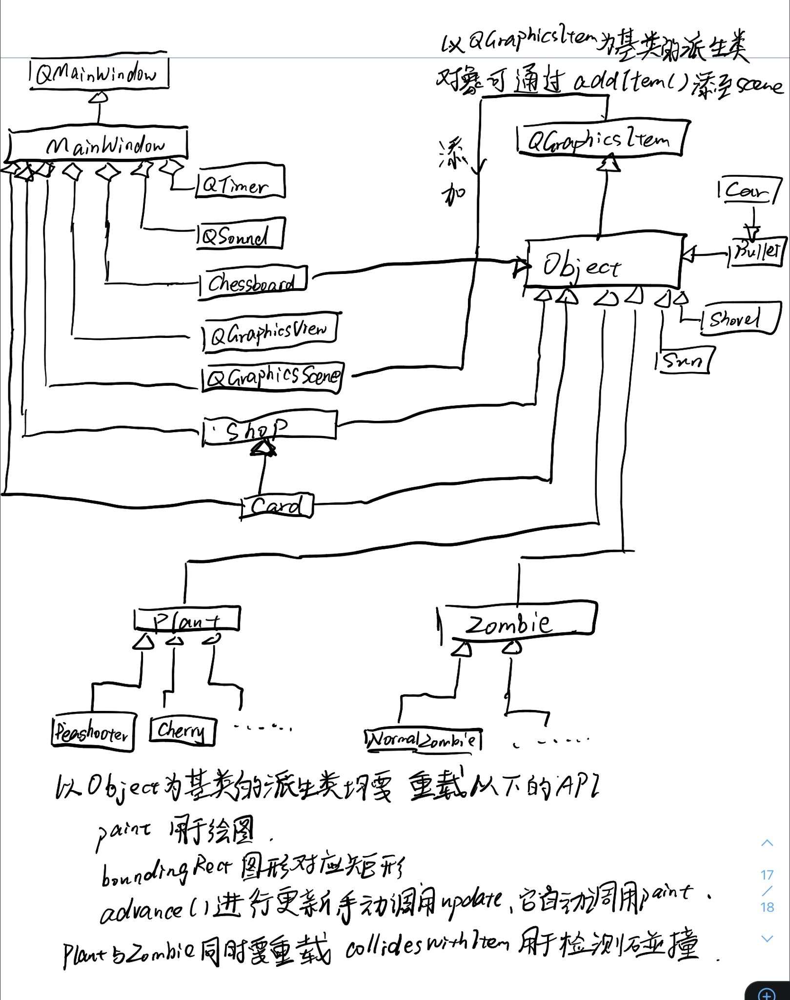

## 2.主要的游戏相关的类

### Object类

这个类和控制台应用的同名类非常类似，但是它继承了Qt框架里面的两个基类

```c++
class Object : public QObject,public QGraphicsItem
```

我们在后面要对框架中的一些虚函数进行重定义，但这是后面的派生类的事情，我们在这个基类里面需要做的就是一些简单的事情，写一些基础的方便外界和派生类进行调用`API`

首先是一些有关位置信息的`API`，需要注意的是如果是设置位置，需要调用基类的`setPos()`函数来调整在场景中的实际位置。

```c++
	//位置信息
    void SetX(int xx){XX=xx;this->setPos(XX,YY);}
    void SetY(int yy){YY=yy;this->setPos(XX,YY);}
    void SetLoc(const Location& loc){XX=loc.x;YY=loc.y;this->setPos(XX,YY);}
    int GetX()const{return XX;}
    int GetY()const{return YY;}
    Location GetLoc()const{return Location(XX,YY);}
```

下面是一些跟类型相关的函数，这对植物和僵尸进行攻击的时候非常有用，具体的枚举类在`Config`里面，我封装了几个函数用来判断这个`Object`对象是不是植物或者僵尸，还是商店，如下所示：

```c++
	void SetType(int tt){mytype=tt;}
    int GetType(){return mytype;}
    bool IsPlant();
    bool IsZombie();
    bool IsShop(){return mytype==Shop_t;}
```

下面前两个函数用来设置动图，我这个游戏生动的效果最关键的就是靠这两个函数，然后通过状态机来设置不同的动画，这样就可以设置生动的效果了，需要注意的是，`DeadMovie`是死亡的时候需要用到的动画，因为死掉的时候头会掉，所以我们需要设置一个身子倒下和一个头掉的动画；后面两个函数是用来判断`Gif`动画是否播放完全，比如僵尸死掉的时候，需要让头落在地上之后再清除它。

```c++
 	void SetWalkMovie(QString mvpth);//gif动画
    void SetDeadMovie(QString);//gif动画
   	bool PlayMovieEnd1(){return walkmovie->frameCount() - 1 == walkmovie->currentFrameNumber();}
	bool PlayMovieEnd2(){return deadmovie->frameCount() - 1 == deadmovie->currentFrameNumber();}
```

和上面的函数相关联的是几个数据成员，用`pth1`和`pth2`来记录上面两个`QMovie`的路径，以免赋值相同的动画而被刷新。

```c++
    QMovie *walkmovie,*deadmovie;
    QString pth1,pth2;
```

下面还有两个函数，用来更新的时候及时删掉死掉的自己。

```c++
	void ClearSelf();//把自己从scene里清除
    virtual void CheckAndRemove();//检查是不是死了，死了就清除自己
```

### Plant类

这个是植物基类，它继承了`Object`类，在这里面我们需要定义一些植物相关的共性特征

```c++
class Plant : public Object
{
    Q_OBJECT
public:
    Plant(int xx,int yy,int hpmax,int ttype);
    void paint(QPainter *painter, const QStyleOptionGraphicsItem *option, QWidget *widget = 0)override;
    bool collidesWithItem(const QGraphicsItem *other, Qt::ItemSelectionMode mode) const override;
    QRectF boundingRect() const override;
};
```

绘图函数就是播放`gif`的当前帧

```c++
    if(walkmovie!=nullptr){
        painter->drawImage(boundingRect(),walkmovie->currentImage());
    }
    if(deadmovie!=nullptr){
        painter->drawImage(boundingRect(),deadmovie->currentImage());
    }
```

碰撞检查函数呢，主要是给豌豆类准备的，当和植物和对方在同一行，并且对方在植物的右面，就相当于碰撞，这样的话我就可以通过这个来判断是否需要发射弹了。

```
bool Plant::collidesWithItem(const QGraphicsItem *other, Qt::ItemSelectionMode mode) const{
    return other->y()== y()&&other->x()>x();
}
```

### Zombie类

这个是僵尸类，里面封装了一些跟僵尸有关掉的共性特征

其中值得注意的是，它比植物增加了以下的`API`

```c++
	void Burn(){burned=true;}
    virtual void Move();
    void Ice(){if(!iced){iced=true;speed=1;}}
```

第一个函数和燃烧有关，当僵尸被樱桃或者土豆地雷炸死的时候，僵尸就会被烧死，那么我会根据`burned`布尔量来设置死亡的动画。

第二个是僵尸移动的函数，设置为虚函数的原因是，对于一些特定的僵尸，我们需要重定义移动函数，比如撑杆跳僵尸，我需要根据跳跃的不同阶段来切换不同的`Gif`动画！

第三个是跟寒冰射手有关，寒冰射手会让僵尸减速。

下面的函数是跟大蒜有关的，随机返回一个我们需要移动的量（行与行之间间隔是100）

```c++
    int CheckRow(){
        if(y()==130)return 100;
        else if(y()==530)return -100;
        else if(t%2==0)return 100;
        else return -100;
    }
```

### ChessBoard类

这个棋盘类跟我们控制台应用的不太一样，它的功能在本阶段主要是维护地块的位置和处理鼠标事件！

它的外接矩形基本和我们的地图重合，如下图所示，就是绿色的那个部分

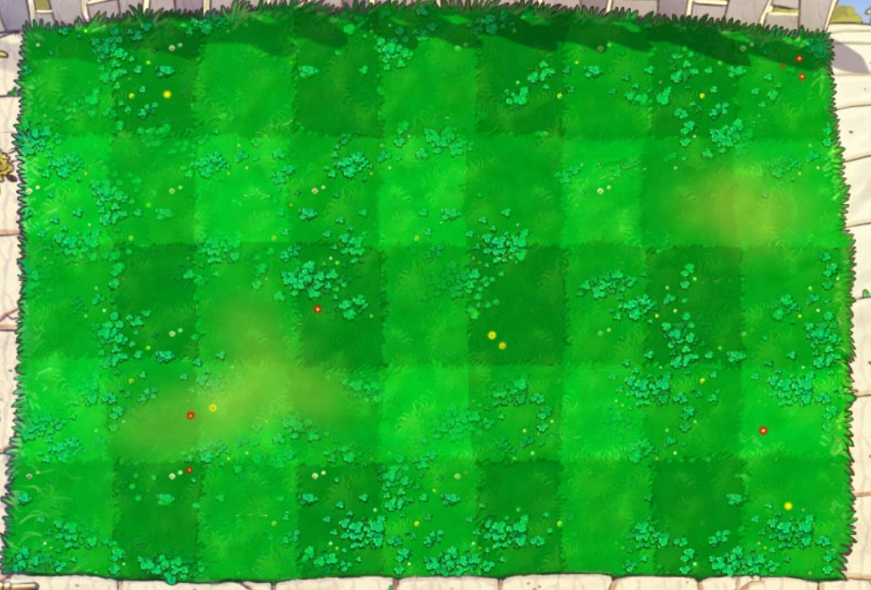

这个的鼠标拖放事件主要跟放置植物和铲除植物有关，当我从`Card`里面产生一个拖动时间，我通过`QMimeData`类来存放有关的信息，当我在棋盘上面获得一个拖放时间的时候，我读取`event`里面存储的相关信息，

实际上，**关于植物放置的拖放事件我存放的是带放置的植物的种类`type`！**

```c++
mime->setText(QString().sprintf("%d", ttype));
```

**关于铲除植物的拖放事件，我在`mimeData`里面放了一个`"remove"`字符串！**

```c++
event->mimeData()->text()==QString("remove")
```

所以我根据拖放事件携带的不同信息来进行相应的处理就好，值得注意的是，我怎么知道我的光标在哪一个方格里面呢

我在`Config`里面设置了两个函数，用来根据我具体的光标所在的坐标来计算当前所在地块中心的坐标！这样就能准确定位植物放置和清除的位置了！

这两个函数是

```c++
int CurX(int x){
    int n=(x-290)/80;
    return n*80+290;
}
int CurY(int y){
    int n=(y-130)/100;
    return n*100+130;
}
```

### 卡片类Card

卡片类就是商店上面的卡片，我可以拖动卡片然后在上面的棋盘上面放置植物，这里面有关于拖动的两个函数就是两个鼠标事件，当我点击了其中一个卡片就会生成一个拖动事件，我拖动的话会用`MimeData`携带一些信息

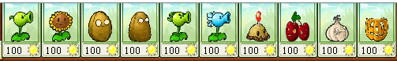

我们需要重载下面的两个函数

```
    void mousePressEvent(QGraphicsSceneMouseEvent *event) override;
    void mouseMoveEvent(QGraphicsSceneMouseEvent *event) override{}
```

对于拖动的生成如下所示，注释里面包含了一些构思

```c++
void Card::mousePressEvent(QGraphicsSceneMouseEvent *event){
    qDebug()<<"按下鼠标！";
    if (!canbuy){ event->ignore();return;}//如果没有冷却的话canbug会设置为false
    QDrag* drag = new QDrag(this);
    QMimeData* mime = new QMimeData;//生成一个信息类对象
    QImage image(imgpth);
    mime->setText(QString().sprintf("%d", ttype));//把卡片对应植物的枚举值放入信息类对象里面
    drag->setHotSpot(QPoint(35, 35));
    drag->setMimeData(mime);
    drag->setPixmap(QPixmap::fromImage(image));
    drag->exec();//形成一个拖动事件
}
```

这样**卡片和棋盘构成了拖放植物的用户界面逻辑，而放置植物的内在逻辑由商店来实现。**

### Shop商店类

商店的主要作用就是实现产生和放置植物的逻辑，还有给卡片提供一个容身之地，所以商店需要有一个创建卡片的函数，用来摆放卡片！

具体的实现逻辑很单纯，new一个卡片对象，把它添加到自己的卡片列表里面，并且在场景上添加卡片，以便显示

```c++
void CreateCard();

void Shop::CreateCard(){
    Card* c1=new Card(450,30,":/resource/Peashooter.png",PeaShooter_t);
    ...
    scene()->addItem(c1);cardlist.append(c1);
   	...
}
```

注意，添加到卡片列表都是按顺序的，因为我们在设置冷却的时候可以**跟据植物的类型作为下标来设置冷却！**

下面的创造植物函数实现了这个逻辑

```c++
void Shop::CreatePlant(int xx,int yy,int ttype){
    cardlist[ttype-1]->Cold();//根据类型作为下标设置冷却，妙啊
    switch (ttype) {
    case PeaShooter_t:CreatePeaShooter(xx,yy);break;
    ...
    default:break;
    }
    return;
}
```

从上面的函数，我们可以看出我的创建植物的逻辑**利用了工厂设计模式**

利用如下`API`来在相应的坐标下创建植物，下面举一个例子：

```c++
void CreatePeaShooter(int xx,int yy){
    PeaShooter* p1=new PeaShooter(xx,yy);scene()->addItem(p1);sun-=GetMoney(PeaShooter_t); 
}
...
```

这样购买的逻辑就实现了

综合起来，购买的逻辑就是这样的流程：

1. 鼠标点击卡片拖动，产生一个拖动事件，拖动事件携带了需要被放置的植物的信息。

2. 当拖动事件在地块下放置，触发拖放事件，函数从中取出信息，根据拖放的地点确定地块，并且判断是否适合放置，如果可以的话，就调用商店的购买逻辑！！！

   ```c++
       if(!canput)event->ignore();
       else{//开始种植物了
           qDebug()<<"放植物aaaa";
           shop->CreatePlant(curx,cury,ittype);
       }
   ```

3. 商店在对应地块创建植物，并且减去相应的现金！

### 铁锹类shovel

铁锹的本质和卡片一样，但是拖动铁锹的时候让拖动事件携带的是一个`"remove"`字符串！

在棋盘进行处理的时候，如果发现了这个字符串就进入如下逻辑，铲除相应的植物！

```c++
if(event->mimeData()->text()==QString("remove")){
        QPointF pos = mapToScene(event->pos());
        int curx=CurX(pos.x());
        int cury=CurY(pos.y());
        QList<QGraphicsItem*> list = scene()->items(QPoint(curx, cury));
        for(int i=0;i<list.size();i++){
            Object* obj=qgraphicsitem_cast<Object*>(list[i]);
            if(obj->IsPlant()){
                //是植物就拿走
                scene()->removeItem(obj);
                break;
            }

        }
        return;
    }
```

### 弹和房门前的推车

弹应该有三种，一种是普通弹，一种是寒冰弹，一种是小推车（继承）

初始化的时候根据种类来设置具体的属性

```
    switch (fun) {
    case normal_t:atk=1;break;
    case ice_t:atk=1;ice=true;delete img;img=new QPixmap(":/resource/PeaSnow.png");break;
    case car_t:atk=10000;break;
    }
```

并且设置移动函数，以一定的速率进行移动

```c++
void Bullet::Move(){

    if(t%NormalBullet_Mvgap==0)
        SetX(GetX()+NormalBullet_Speed);
}
```

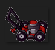

推车的本质就是弹，所以我用推车继承了弹类，不过重载了移动函数，只有在第一次碰到僵尸的时候他会以一个很快的速度移动，并且打掉一路上的所有僵尸！

```c++
class Car : public Bullet
```

## 3.各种植物

在具体的植物类里面，我们应该重载`advance`函数！

并且，在具体植物的构造函数里面，我们应该给植物传入初始Hp和类型，这些都是一些常量，我设置在了`Config`文件里面，下面以豌豆射手举例

```c++
PeaShooter::PeaShooter(int xx,int yy)
    :Plant(xx,yy,Hp_PeaShooter,PeaShooter_t)//后面两个是常量
{
}
```

### 豌豆射手

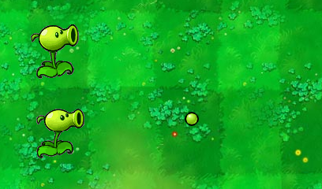

豌豆射手的具体逻辑就是在对应的时间间隔发射弹，注意，这里我需要用到之前`Plant`类的碰撞检测函数

```c++
QList<QGraphicsItem*> list=collidingItems();
```

我通过下面这个函数，得到这个时刻与我这个豌豆射手碰撞的所有的item，我可以通过遍历这个列表，如果有植物跟豌豆射手在一排并且在右边，那么豌豆射手就发射弹！注意，没有僵尸的话，它是不会发射弹的哦！

```c++
if(qgraphicsitem_cast<Object*>(list[i])->IsZombie()){
                Bullet* blt=new Bullet(this->XX+20,this->YY-15,normal_t);
                scene()->addItem(blt);
}
```

豌豆射手的更新函数如下所示，后面的植物跟它类似，不同的我会再提

```c++
void PeaShooter::advance(int phase){
    if(phase==0){//预备更新
        CheckAndRemove();//检查是不是死了，死了就移走
        SetWalkMovie(":/resource/Peashooter.gif");
        Attack(t);//攻击
    }
    else{
        this->QGraphicsItem::update();//更新动画！
    }
}
```

### 向日葵

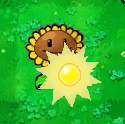

向日葵的攻击函数就是在特定时间产生阳光

```c++
if(t%SunFlower_Sungap==0){
        Sun* s=new Sun(x()+10,y()+20);
        scene()->addItem(s);
}
```

### 双发射手

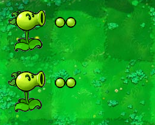

这个逻辑跟豌豆射手类似，只不过是连续发射两发弹！

### 寒冰射手

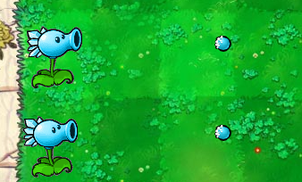

寒冰射手的攻击函数会发射一枚寒冰弹，弹类的属性会在构造函数里面设置，它具体的属性会根据这个`fun`来设置！

```c++
    switch (fun) {
    case normal_t:atk=1;break;
    case ice_t:atk=1;ice=true;delete img;img=new QPixmap(":/resource/PeaSnow.png");break;
    case car_t:atk=10000;break;
    }
```

那么弹在攻击到敌人的时候，根据自己的类型来判断是否要冻住敌人之类...

### 坚果墙


坚果墙是抵御僵尸很有利的植物，我为它设置了**三种形态**，对应于不同的生命值，坚果墙的动画是不同的，分别对应于下面三个动画！

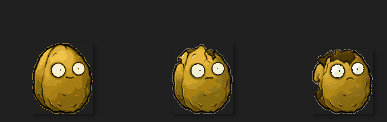

### 高坚果

高坚果比坚果墙要生命值更高，并且可以抵挡撑杆跳僵尸的跳跃！同时，**高坚果也对应着三种不同的状态**

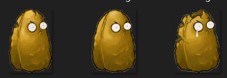

### 樱桃炸弹

樱桃炸弹我为它设置了一个冷却时间，当冷却时间到了的时候，它就会爆炸，注意，爆炸的时候炸死的僵尸会给他们设置成`burned`状态，这样**他们死了之后就会被设置成烧死的动画**，并且**樱桃爆炸也有动画**

```c++
 for(int i=0;i<list.size();i++){
        tmp=qgraphicsitem_cast<Object*>(list[i]);
        if(tmp->IsZombie()){//如果是僵尸的话就攻击它
            qgraphicsitem_cast<Zombie*>(tmp)->Burn();//设置为燃烧状态
            tmp->IsAttacked(10000);
        }
}
```

### 大蒜

同样，**大蒜我也设置了三种不同的形态**。


值得注意的是，在僵尸的攻击函数里面，我进行了一些逻辑上的设置，如果攻击的目标是大蒜，那么僵尸会以每次更新20个单位来移动，也就是说，进行五次更新之后他会移动到相邻行，这样**防止僵尸“瞬移”，增加视觉上舒适的体验**！

```c++
        if(change!=0){
            if(change>0){
                SetY(GetY()+step);
                change-=step;
            }
            else if(change<0){
                SetY(GetY()-step);
                change+=step;
            }
            qDebug()<<change;
            return;
        }
```

### 南瓜头

不出意外，南瓜头也被我设置成了三种不同的形态


有一点，在南瓜头种植的时候，我特意进行了一些判断，来保证植物和南瓜头可以在一个地块里面共生

```c++
        if(ittype!=Pumpkin_t&&obj->IsPlant()&&obj->GetType()!=Pumpkin_t){
            //看看是不是南瓜头，如果我本身就是南瓜头，或者原来有南瓜头才可以放置其他植物
            canput=false;
        }
```

### 土豆地雷

土豆地雷跟倭瓜非常像，并且比倭瓜更加细节，所以我利用土豆地雷来代替倭瓜。

土豆地雷的特点就是：先埋入地下，过一会之后长出来遇到僵尸爆炸！逻辑上跟樱桃类似~


爆炸的时候也有特效

## 4.各种僵尸

### 普通僵尸

对于僵尸的特效设置，我设置了几种不同的状态

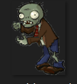

走路的时候播放走路的动画；攻击的时候播放攻击的动画；死掉的时候分为两种情况：

如果被烧死就播放烧成灰的特效，否则播放掉脑袋的特效。这样**非常还原原版！**

```c++
void NormalZombie::CheckAndRemove(){
    if(!IsLive()){
        if(burned){
            SetWalkMovie(":/resource/Burn.gif");
        }
        else{
            SetWalkMovie(":/resource/ZombieDie.gif");
            SetDeadMovie(":/resource/ZombieHead.gif");
        }
        if(PlayMovieEnd1()){
            qDebug()<<"死掉了";
            ClearSelf();
        }
    }
    else{
        if(!isatking)SetWalkMovie(":/resource/ZombieWalk1.gif");
        else SetWalkMovie(":resource/ZombieAttack.gif");
    }
}
```

### 路障僵尸

路障僵尸跟普通僵尸差不多，没什么难度，所以我利用铁门僵尸代替，铁门僵尸平时有两种特效，一种是有门，一种是没有门。值得注意的是，**有门时候攻击和没门时候攻击是不一样的哦**

### 读报僵尸

读报僵尸在报纸被打掉的时候会进行加速！


### 撑杆跳僵尸

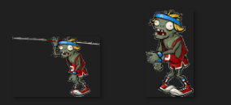

撑杆跳僵尸的亮点是它在跳过植物的时候产生特效，跟原版几乎一模一样。

这个特效的实现实际上还是利用状态机，把僵尸分成4种状态，

第一种（jmp==0）是还没有跳的时候，这个时候每次遍历检查前面是不是有植物，如果有就准备跳跃，播放动画1

第二种（jmp==1）是跳了一半，这个时候跳过植物，播放动画2

第三种（jmp==2）这时候检测是否播放完，如果播放完把状态设置为状态3

第四种（jmp==3）僵尸的杆子丢掉，僵尸正常走路！

```c++
void PolesZombie::Move(){
    if(jmp==1){//跳了第一次
        if(PlayMovieEnd1()){
            SetX(GetX() - speed);
            jmp=2;
            return;
        }
        else if(!PlayMovieEnd1()) return;
    }
    else if(jmp==2){
        if(PlayMovieEnd1()){
            jmp=3;
            speed=2;
        }
        else return;
    }

    if(jmp==0){//还没跳过
        QList<QGraphicsItem*> list=collidingItems();
        Object* tmp=nullptr;
        for(int i=0;i<list.size();i++){
            tmp=qgraphicsitem_cast<Object*>(list[i]);
            if(tmp->IsPlant()&&tmp->GetType()!=HighNut_t){//如果是植物的话就跳过它
                jmp=1;
                speed=90;
                return;
            }
        }
    }
    Zombie::Move();
}
```

### 小丑僵尸

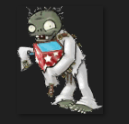

小丑僵尸的头被打掉之后可以继续走，并且有一定概率自爆，自爆的时候会炸死周围的植物！

### 投掷僵尸

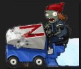

因为没有找到投篮僵尸的资源，我利用兵车僵尸的资源来代替，同时没有找到篮球的资源，所以我直接把投掷僵尸设置成了推土车，所到之处没有植物能够挡住它，但是可以通过樱桃炸弹直接炸死！

推土车的动画也很丰富，根据汽车的破坏程度有三种特效，最后死亡镜头是汽车爆炸！

# 三.亮点与附加功能

1.高还原度，高度还原了原版植物大战僵尸的界面和特效

2.增加推土车，推土车可打掉路上的所有僵尸

3.增加铁铲，可以铲除植物

4.非常精细化的细节，各种植物和僵尸都有细节的特效，具体会在验收时候演示

# 四.最后的效果

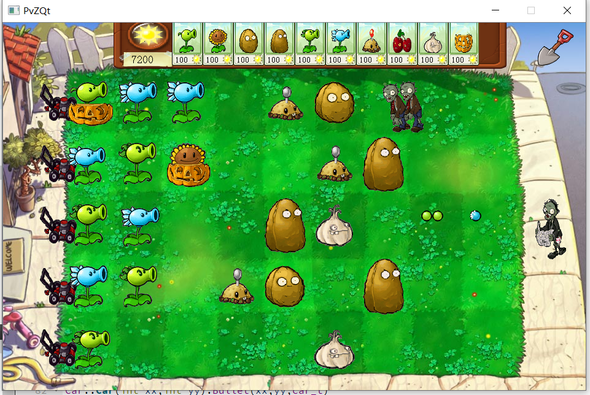

# 五.总结与感悟

在第三次阶段，**我对我的代码进行了完全的重构，花费了大量时间，从开始学Qt到构思，大概用了5-6个工作日，每个工作日耗费5小时以上**，但是这一切的辛苦是值得的，游戏基本还原了原版植物大战僵尸的功能与特效，也是我第一次做了一个还算可以的的游戏。

虽然说代码的细节是完全重构的，但是内在的思想是一致的，我在本阶段的coding中不断对比和控制台游戏的区别，其中我总结了以下几点：

首先，由于利用了Qt框架，我对于棋盘的维护有了变化，控制台应用中，棋盘是通过一个三维向量来维护的，也就是说我进行攻击和移动控制都需要对向量进行遍历，但是在这个框架之下，我是通过坐标和图形来进行判断和控制的，通过场景类，我更方便地管理了各个植物和僵尸，同时得益于`scene()`函数和`advance()`函数也能够把攻击和移动控制功能放入各个植物和僵尸类里面，这样我添加植物和僵尸会更加方便，同时他们之间的依赖性也降低了很多！

同时，我在本阶段对于特效的细节格外在意，由于`GUI`的本质是为了让用户使用起来体验更好，所以我对于不同的植物和僵尸设置了比较合理的特效动画，也费了不少心思。

最后，在图形界面阶段，我对于一些类模块，设计模式也有了一点点思考，比如商店设置了工厂模式来产出植物等等，还有对于枚举的设置过程中，我能够更巧妙利用他们的连续性来设置一些小`trick`，这些正是我前两个阶段中不足的。重构的过程，虽然艰辛，但是很值得！感谢助教哥哥一学期的陪伴！感谢老师的悉心教导！